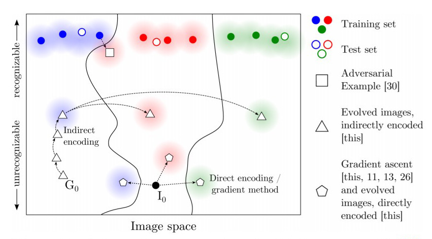

# Collection of ML System Misclassification

This repo collects ideas on misclassification examples for ML (machine learning) systems, including those occurred and those could be manually triggered. For some, we'll also include some attempt to  reproduce and spot them. This collection prefers industrial-strength and state-of-the-art ML systems.

We'll try to collect examples from as many fields (image processing, reinforcement learning, natural language processing, etc.) as possible. 

The [DeepXplore](https://dl.acm.org/citation.cfm?id=3132785) paper has already collected some examples -- mainly on image processing -- so we'll not spend too much time on this area. We do have some image-processing DNNs fooled by *another* kind of adversarial examples, and we'll see them later.

[CleverHans](https://github.com/tensorflow/cleverhans) is a library for benchmarking ML systems, testing their performance against adversarial examples. This library may automate most of work when it comes to reproducing certain misclassification of ML system.

## [Real-world Accidents Involving ML Systems](./ML-accidents.md)

- Self-driving car accidents

- Stereotypical and biased AI (racism, anti-feminism, etc.)

## Generating Counterexamples

(Materials under [`/generative`](generative/))

Generating counterexamples for a given ML system can provide insight on where it could go wrong. With regard to the examples generated, these methods can be classified into the following categories.

### Adversarial methods

Adversarial methods perturb a given (valid) input by small amount so that it's still the same under human perception, but classified differently by machine.

(On the other hand, "adversarial" is also occasionally used as generic term for "various counterexamples.")

Adversarials are particularly useful for attacking ML systems since the variation is made difficult to perceive by human. Accordingly, some defensive methods are designed to prevent such attack. [This](generative/ML-attack-defence.md) introduces some attack and defence approaches relevant to ML systems.

### Direct encoding

Direct encoding pick up a input directly from the input space which usually is unrecognizable, but the target DNN is confident that it belongs to certain class. 

This category is rare. The paper [[1](papers/dnn-fooling-1412.1897.pdf)/[review](papers/dnn-fooling.md)] is representative on this method; the term "direct encoding" is also coined is this paper.

### Indirect encoding

Indirect encoding instead pick a value from a *latent space*, and generatively map it to the input space (typically using GAN, generative adversarial network). The generated input may be valid or invalid but resembles a valid input, while the target DNN will be fooled.

The paper [[1](papers/dnn-fooling-1412.1897.pdf)/[review](papers/dnn-fooling.md)] applies indirect encoding to generate unnatural images that will more effectively confuse DNNs. 

[[11]](https://arxiv.org/pdf/1710.11342.pdf) instead produces valid and *natural* images, which is alleged to have the advantage of being more real-world than the outcome of the other methods.

The three types above is compared in the figure below: 

---

With regard to the access required to underlying model, the methods can be again classified into these categories:

1. White-box method. They require full knowledge to the ML systems being studied, which in the case of DNN will be the structure and weights of network. One example is the [DeepXplore](https://dl.acm.org/citation.cfm?id=3132785) system.

1. Black-box method. They could work with ML systems with only input and output accessible. 

    Black-box methods differ in "opacity" of the box. For example, in classification model with confidence output, while some methods require access to the confidence value, some only require classification result. 
    
    - An example of the former case is [[1](papers/dnn-fooling-1412.1897.pdf)/[review](papers/dnn-fooling.md)]: the evolutional algorithm is fed by confidences of target DNN. 

    Certain methods only need input and output given as whole datasets and could infer correspondence between datums.

    - This ability in [[3](papers/black-box-1602.02697.pdf)/[review](papers/black-box.md)] enables attack on remote cloud ML systems. 

## Image Processing

1. Indirectly-encoded images. The idea has been explained above. Proposed in [[1](papers/dnn-fooling-1412.1897.pdf)/[review](papers/dnn-fooling.md)]

1. Black-box MNIST attack. Adversarial method for black-box ML systems which could be applied to remote ML platform, such as Amazon and Google ML services. Proposed in [[3](papers/black-box-1602.02697.pdf)/[review](papers/black-box.md)]. 

1. Natural adversarial examples. Adversarial examples that are more likely in real-world scenario. Proposed in [[11](https://arxiv.org/pdf/1710.11342.pdf)/[review](papers/natural-adv.md)].

In addition, the papers [[4]](https://arxiv.org/pdf/1412.6572.pdf) and [[5]](https://arxiv.org/pdf/1607.02533.pdf) take on methods that much resemble those found in DeepXplore paper.

## Natural Language Processing (NLP)

1. Adversarial by semantic-preserving transformations. Generates perturbed query through semantic-preserving rules for reading comprehension system. Proposed in [[6](https://arxiv.org/pdf/1707.07328.pdf)/[review](papers/eval-reading-system.md)]

1. Natural adversarial examples for text entailment and machine translation. Proposed in [[11](https://arxiv.org/pdf/1710.11342.pdf)/[review](papers/natural-adv.md)].

`TODO`: fill the categories below.

## Reinforcement Learning

