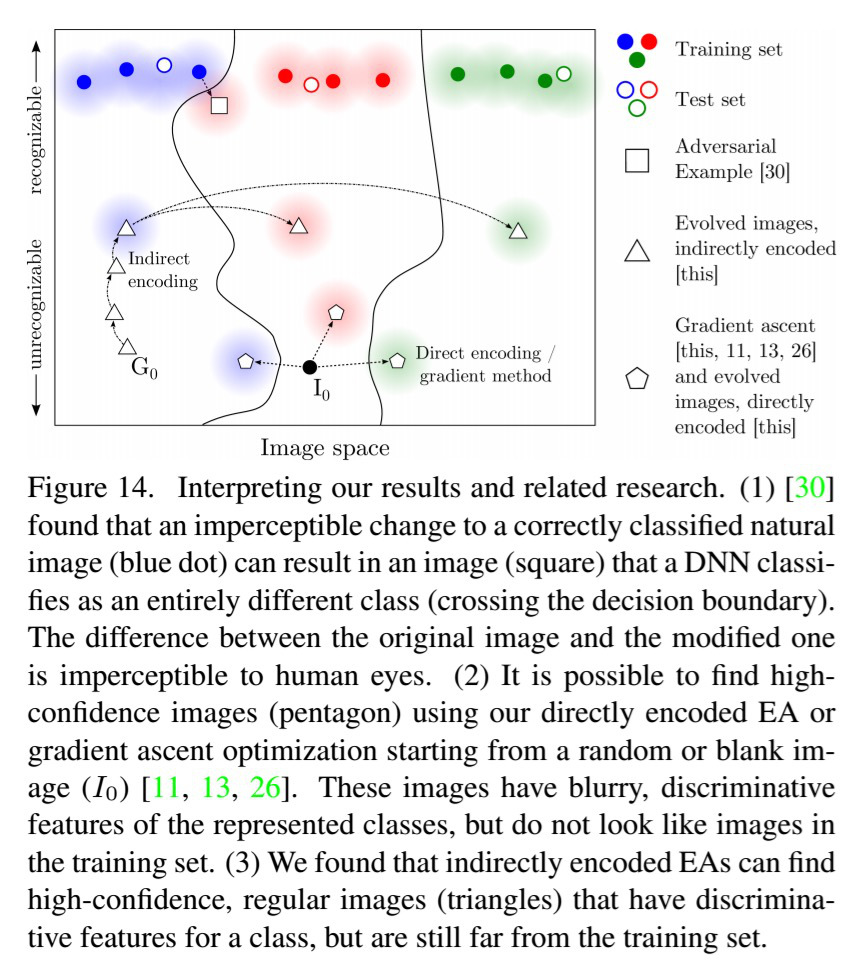
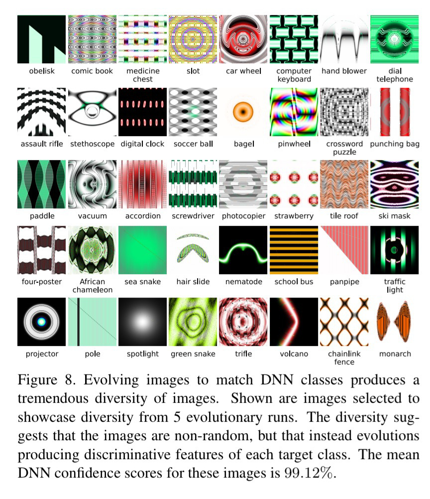

(This is a topic in [README.md](../README.md).)

# Indirectly Encoded Images

Nguyen et al. proposed a mutational, pattern-generating method [[1]](dnn-fooling-1412.1897.pdf) for producing adversarial images that fools DNNs, based on compositional pattern-producing network (CPNN). It resulted in images that are not likely in usual occasions, but could be used as an attack. A comparison between images generated by this method and other methods: 

In particular, though DeepXplore is not restricted to certain region of input space, it has no knowledge on object patterns and is unlikely to produce images rich in patterns. These patterns are interesting because it sheds some light on *what exactly a DNN is looking at* during the classification process. 

Take the school bus image as an example. As far as the DNN is concerned, a school bus is alternating yellow and black lines, but does not need to have a windshield or wheels.

## Adversarial Dataset

The original adversarial examples used in Nguyen paper that consists of [5000 images](fooling_images_5000_cppn.tar.gz).

## Reproduction

The DNN involved is an object classifier based on the "AlexNet" architecture; specifically, Nguyen et al. used the pre-trained AlexNet DNN provided by the Caffe [[2]](https://arxiv.org/abs/1408.5093) software package. 

We found that implementation of Caffe is indeed stable, and can be found at [https://github.com/BVLC/caffe](https://github.com/BVLC/caffe).

`TODO`: the Caffe package should be brewed under the path `image-process/Caffe`.

Afterward, the [fooling images](fooling_images_5000_cppn.tar.gz) should be fed to the DNN and the same results are expected. 

`TODO`: supply a script that brews Caffe and feeds image to the resulting DNN. 